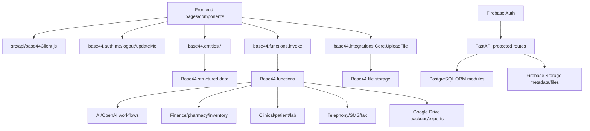

# Complete Base44 Migration Intelligence Report

Status: planning and intelligence only.

This report inspected:

- `base44/entities`
- `base44/functions`
- frontend pages/components using Base44
- storage and document references

No real data import was run. No production migration was run. No patient records were opened or modified. No production app code was changed for this report.

## Executive Summary

Horizon now has an independent platform foundation in place: Firebase Auth, protected FastAPI routes, PostgreSQL ORM scaffolds, app-user linking, RBAC, document metadata, audit logging, Firebase Storage scaffolding, and a migration health dashboard.

The remaining Base44 dependency surface is broad. The repository contains:

- 28 Base44 entity definition files
- 143 Base44 function entrypoints
- 320 frontend files with Base44 references

The safest operational next step is to replace a small identity/admin workflow end-to-end, then document metadata/file handling, before touching scheduling, patient, clinical, billing, pharmacy, finance, wholesale inventory, AI, or telephony workflows.

## A. Full Entity Inventory

Total entities found: 28

| Entity | Category | Risk | Notes |
| --- | --- | --- | --- |
| PendingInvitation | identity/admin | Low | User invite workflow; good early migration candidate |
| StaffProfile | identity/admin | Medium | Staff identity/profile details; has signature/photo file URL fields |
| Institution | identity/admin | Medium | Institution/customer organization data; linked to credit workflows |
| StaffCredentialDocument | documents/files | Medium | Credential metadata plus file URL |
| TeleProviderAvailability | scheduling/tasks | Low | Provider availability settings |
| TeleProviderTimeOff | scheduling/tasks | Low | Provider blocked dates/times |
| HomeCareSchedule | scheduling/tasks | High | Patient/staff care schedule |
| TeleAppointment | scheduling/tasks, clinical/patient, billing | High | Patient, provider, notes, consent, billing, recordings |
| WholesaleMessage | scheduling/tasks or billing/pharmacy | Medium | Operational messages; may include order/payment discussion |
| Patient | clinical/patient | High | PHI/PII, consent, medical history |
| Result | clinical/patient | High | Lab/diagnostic results |
| LabResultEntry | clinical/patient | High | Structured lab values |
| Prescription | clinical/patient, billing/pharmacy | High | Medication and pharmacy routing |
| HomeCareReport | clinical/patient | High | Patient condition, observations, care notes |
| CreditSale | billing/pharmacy | High | Sale totals, payment status, invoice PDF |
| CreditMonthlyInvoice | billing/pharmacy | High | Period invoices, balances, payments |
| PurchaseOrder | billing/pharmacy | High | Procurement/inventory movement |
| TeleSubscription | billing/pharmacy | High | Patient subscription billing |
| TeleConsultationBilling | billing/pharmacy | High | Telehealth invoice/payment records |
| WholesaleSubscription | billing/pharmacy | High | Wholesale provider billing |
| WholesaleGRN | billing/pharmacy | High | Goods received, stock cost |
| WholesaleGRNLine | billing/pharmacy | High | Batch/expiry/quantity/cost line data |
| WholesaleReturn | billing/pharmacy | High | Returned stock and credit impact |
| WholesaleReturnLine | billing/pharmacy | High | Return line quantities and credit values |
| RxFavorite | settings/config | Medium | Prescribing templates/favorites |
| TelePricingConfig | settings/config | Low | Pricing configuration |
| TelePaymentGatewayConfig | settings/config | High | Payment gateway/bank configuration; manual review required |
| WholesaleDelivery | documents/files, billing/pharmacy | Medium | Delivery state and proof-of-delivery image |

## B. Function Inventory

Total functions found: 143

All Base44 function entrypoints:

`acknowledgeLabResult`, `adjustInventory`, `analyzeDocument`, `analyzeHealthTrends`, `analyzerIngest`, `appointmentStatusNotify`, `archiveRecord`, `assignOwnerRoles`, `assignUserToOrganization`, `auditAccountBalance`, `autoGenerateKBFromModules`, `backupAllCompaniesToGoogleDrive`, `backupCompanyToGoogleDrive`, `bulkImportPatients`, `calculateCOGS`, `calculateInventoryValuation`, `cancelSale`, `cascadeCompanyStatus`, `checkDrugInteractions`, `checkLowStock`, `checkModuleAccess`, `checkUserApproval`, `checkUserBlocked`, `cleanupDuplicateStock`, `cleanupOrphanedData`, `clearAllSalesData`, `clearPharmacyStock`, `continuousPharmacyStockUpload`, `convertPOToSale`, `createAppointment`, `createExportRequest`, `createInvoice`, `createNotification`, `createOrder`, `createOrderItem`, `createPharmacySale`, `createPrescription`, `createPurchaseOrder`, `createResult`, `createResultFlag`, `createWherebyRoom`, `dialogDlrCallback`, `dispensePrescription`, `extractLabFromPDF`, `extractStructuredData`, `faxInbox`, `faxReceiveWebhook`, `financialReconciliation`, `findLabReport`, `followUpPendingInvitations`, `generateAIReport`, `generateCreditMonthlyInvoices`, `generateCreditSaleInvoice`, `generateExportBundle`, `generateFinancialStatements`, `generateGovernmentReport`, `generateHomeCareInvoice`, `generateInvoicePDF`, `generateLabReport`, `generateManagementPack`, `generatePHN`, `generatePharmacyInvoice`, `generateReceiptPDF`, `generateSOAPNote`, `generateSecurityReport`, `generateSettlement`, `generateSystemSummary`, `generateTestSale`, `getInstitutionForUser`, `getUserAccessLevel`, `helpdeskNotify`, `initializeNotificationPreferences`, `inviteUserToOrg`, `invokeAI`, `issueQueueToken`, `joinTeleRoom`, `listAllUsers`, `listOrganizations`, `logActivity`, `onAppointmentStatusChange`, `patientPortalData`, `patientPortalLogin`, `pbxProvider3cx`, `performBackup`, `postExpenseToGL`, `postGoodsReceiptToGL`, `postJournalEntry`, `postPurchaseOrderToGL`, `postReturnToGL`, `postSaleToGL`, `processBulkImport`, `processReturn`, `readResult`, `receiveBatch`, `receiveGoods`, `receiveInventory`, `reconcilePaymentAccount`, `recordPayment`, `recordPayrollExpense`, `refundVoidSale`, `releaseResult`, `reviewExportBundle`, `revokeOwnershipFromUser`, `runSystemHealthCheck`, `seedFunctionalRoles`, `seedModules`, `seedModulesComplete`, `sendAppointmentReminders`, `sendBulkMessages`, `sendDialogSms`, `sendInvoice`, `sendOverdueCreditNotifications`, `sendSaleSMS`, `sendTeleOtp`, `signResult`, `smartDataAnalysis`, `syncStaffToPayee`, `syncUserApprovalToRoles`, `teleAutoCompleteBilling`, `telephonyAdminSettings`, `telephonyCallLogs`, `telephonyCallSummarize`, `telephonyCheckModuleEnabled`, `telephonyExtensions`, `telephonyIVRs`, `telephonyIngestCallLogs`, `telephonyProvisionTenant`, `telephonyQueues`, `telephonySyncExtensions`, `telephonySyncQueuesAndIVRs`, `testUserFlows`, `updateAppointment`, `updateOrder`, `updateOrderItem`, `updatePrescription`, `updateProductUsage`, `updateResult`, `uploadFile`, `validateSystemSecurity`, `verifyTeleOtp`, `voidRefundInvoice`, `wholesaleStockAlertCheck`, `wholesaleStockUpdate`.

### Function Categories

Identity/admin:

- `assignOwnerRoles`
- `assignUserToOrganization`
- `cascadeCompanyStatus`
- `checkModuleAccess`
- `checkUserApproval`
- `checkUserBlocked`
- `followUpPendingInvitations`
- `getUserAccessLevel`
- `initializeNotificationPreferences`
- `inviteUserToOrg`
- `listAllUsers`
- `listOrganizations`
- `revokeOwnershipFromUser`
- `seedFunctionalRoles`
- `seedModules`
- `seedModulesComplete`
- `syncUserApprovalToRoles`
- `testUserFlows`
- `validateSystemSecurity`

Documents/files and backup:

- `archiveRecord`
- `backupAllCompaniesToGoogleDrive`
- `backupCompanyToGoogleDrive`
- `createExportRequest`
- `generateExportBundle`
- `performBackup`
- `processBulkImport`
- `reviewExportBundle`
- `uploadFile`

Scheduling/tasks:

- `appointmentStatusNotify`
- `createAppointment`
- `createWherebyRoom`
- `issueQueueToken`
- `joinTeleRoom`
- `onAppointmentStatusChange`
- `sendAppointmentReminders`
- `sendTeleOtp`
- `updateAppointment`
- `verifyTeleOtp`

Clinical/patient:

- `acknowledgeLabResult`
- `analyzerIngest`
- `bulkImportPatients`
- `createPrescription`
- `createResult`
- `createResultFlag`
- `dispensePrescription`
- `extractLabFromPDF`
- `findLabReport`
- `generateLabReport`
- `generatePHN`
- `generateSOAPNote`
- `patientPortalData`
- `patientPortalLogin`
- `readResult`
- `releaseResult`
- `signResult`
- `updatePrescription`
- `updateResult`

Billing/pharmacy/finance/wholesale:

- `adjustInventory`
- `auditAccountBalance`
- `calculateCOGS`
- `calculateInventoryValuation`
- `cancelSale`
- `checkLowStock`
- `cleanupDuplicateStock`
- `cleanupOrphanedData`
- `clearAllSalesData`
- `clearPharmacyStock`
- `continuousPharmacyStockUpload`
- `convertPOToSale`
- `createInvoice`
- `createOrder`
- `createOrderItem`
- `createPharmacySale`
- `createPurchaseOrder`
- `financialReconciliation`
- `generateCreditMonthlyInvoices`
- `generateCreditSaleInvoice`
- `generateFinancialStatements`
- `generateHomeCareInvoice`
- `generateInvoicePDF`
- `generatePharmacyInvoice`
- `generateReceiptPDF`
- `generateSettlement`
- `generateTestSale`
- `getInstitutionForUser`
- `postExpenseToGL`
- `postGoodsReceiptToGL`
- `postJournalEntry`
- `postPurchaseOrderToGL`
- `postReturnToGL`
- `postSaleToGL`
- `processReturn`
- `receiveBatch`
- `receiveGoods`
- `receiveInventory`
- `reconcilePaymentAccount`
- `recordPayment`
- `recordPayrollExpense`
- `refundVoidSale`
- `sendInvoice`
- `sendOverdueCreditNotifications`
- `sendSaleSMS`
- `updateOrder`
- `updateOrderItem`
- `updateProductUsage`
- `voidRefundInvoice`
- `wholesaleStockAlertCheck`
- `wholesaleStockUpdate`

Analytics/reporting:

- `generateGovernmentReport`
- `generateManagementPack`
- `generateSecurityReport`
- `generateSystemSummary`
- `logActivity`
- `runSystemHealthCheck`

AI/automation:

- `analyzeDocument`
- `analyzeHealthTrends`
- `autoGenerateKBFromModules`
- `checkDrugInteractions`
- `extractStructuredData`
- `generateAIReport`
- `helpdeskNotify`
- `invokeAI`
- `smartDataAnalysis`

Telephony and communications:

- `dialogDlrCallback`
- `faxInbox`
- `faxReceiveWebhook`
- `pbxProvider3cx`
- `sendBulkMessages`
- `sendDialogSms`
- `telephonyAdminSettings`
- `telephonyCallLogs`
- `telephonyCallSummarize`
- `telephonyCheckModuleEnabled`
- `telephonyExtensions`
- `telephonyIngestCallLogs`
- `telephonyIVRs`
- `telephonyProvisionTenant`
- `telephonyQueues`
- `telephonySyncExtensions`
- `telephonySyncQueuesAndIVRs`

## C. Dependency Graph

High-level dependency graph:

Current independent foundation already replaces the bottom path for isolated workflows:

- Firebase Auth
- protected FastAPI routes
- PostgreSQL ORM scaffolds
- app-user linking
- profile module
- organization/admin scaffold
- RBAC
- document metadata scaffold
- audit logging scaffold
- system health dashboard

Remaining production pages still depend on the Base44 path.

## D. Frontend Pages Dependent on Base44

Frontend files with Base44 references: 320

Heavy dependency areas:

- `src/Layout.jsx`
- `src/lib/AuthContext.jsx`
- `src/api/base44Client.js`
- Admin pages under `src/pages/Admin*`
- Patient/EMR/clinical pages under `src/pages/Patient*`, `src/pages/EMR.jsx`, and `src/components/emr/*`
- Pharmacy pages under `src/pages/Pharmacy*` and pharmacy components
- Finance/billing pages under `src/pages/Finance*`, `src/pages/Billing.jsx`, and invoice components
- Wholesale pages/components under `src/pages/Wholesale*` and `src/components/wholesale/*`
- Telemedicine/telephony pages and components
- Helpdesk, signage, notification, and AI components

Top frontend entity dependencies by reference count:

| Base44 entity reference | Approx refs |
| --- | ---: |
| `AuditLog` | 83 |
| `Patient` | 80 |
| `Organization` | 58 |
| `PharmacyStock` | 41 |
| `CompanyProfile` | 40 |
| `UserRole` | 33 |
| `StaffProfile` | 29 |
| `Prescription` | 29 |
| `Role` | 25 |
| `TeleAppointment` | 22 |
| `WholesaleOrder` | 21 |
| `UserApproval` | 21 |
| `Location` | 20 |
| `Appointment` | 19 |
| `User` | 18 |
| `PharmacySaleHeader` | 18 |
| `WholesaleCreditAccount` | 17 |
| `WholesaleConnection` | 17 |
| `Result` | 16 |
| `OrganizationModuleAccess` | 14 |

Important note:

The frontend references many Base44 entities that are not present in `base44/entities/` in this branch. Those are high-risk/unknown until their schemas and export sources are confirmed.

## E. Storage/File Dependencies

Detected storage/file dependency patterns:

- Base44 function `uploadFile`
- direct `base44.integrations.Core.UploadFile`
- file URL fields such as `file_ref`, `file_url`, `photo_url`, `recording_url`, `invoice_pdf_url`, `proof_of_delivery_url`, `profile_photo_url`, `e_signature_url`, `seal_url`, `primary_logo_file_ref`, `secondary_logo_file_ref`
- AI file inputs through `file_url`
- Google Drive backup/export functions

Known file-dependent areas:

- Staff credentials: `StaffCredentialDocument.file_ref`
- Staff profile assets: `StaffProfile.e_signature_url`, `seal_url`, `profile_photo_url`
- Patient photo: `Patient.photo_url`
- Telehealth: `TeleAppointment.pre_consult_files`, `recording_url`
- Credit sale invoices: `CreditSale.invoice_pdf_url`
- Wholesale delivery proof: `WholesaleDelivery.proof_of_delivery_url`
- Helpdesk screenshots and attachments
- EMR documents and lab PDFs
- Branding/logo files
- Signage media
- Cheque/payment images
- Fax PDFs
- Export bundles, system reports, management packs, government reports

Firebase Storage mapping:

- Store actual files in Firebase Storage.
- Store file metadata in PostgreSQL `document_metadata`.
- Preserve original Base44 URL/path, new Firebase path, MIME type, byte size, checksum, owner module, organization, uploader, migration batch ID, and created timestamp.

## F. High-Risk Modules

Highest-risk modules:

- Clinical/patient: Patient, EMR, lab results, prescriptions, SOAP notes, home care reports
- Billing/pharmacy/finance: pharmacy sales, invoices, payments, credit sales, GL posting, reconciliation, COGS, inventory valuation
- Wholesale inventory and returns: GRN, returns, stock updates, credit accounts
- Telemedicine: appointments, recordings, consent, billing, OTP, rooms
- Payment gateway configuration: bank details, gateway keys, merchant identifiers
- AI/automation over clinical/files: document analysis, lab extraction, SOAP generation, health trend analysis
- Telephony/SMS/fax: external providers, call logs, DLR callbacks, fax documents
- Bulk imports and destructive cleanup: `bulkImportPatients`, `processBulkImport`, `clearAllSalesData`, `clearPharmacyStock`, `cleanupDuplicateStock`, `cleanupOrphanedData`

Reasons:

- PHIPA/PII exposure
- clinical safety
- financial reconciliation
- inventory correctness
- irreversible side effects
- external provider credentials
- generated document and file dependencies

## G. Low-Risk Modules

Lower-risk modules to migrate first:

- Pending invitations
- Staff profiles without credential/file import
- Organization list and basic organization admin
- Roles and role membership
- Provider availability/time-off
- Tele pricing config
- Non-secret platform feature/config flags
- Notification preferences
- Document metadata for safe test files
- Audit log scaffolding
- System health/migration dashboard

These modules are still protected and audited, but they avoid direct patient care records, payment ledgers, pharmacy stock, and clinical interpretation.

## H. Recommended PostgreSQL Mappings

Identity/admin:

- `PendingInvitation` -> `pending_invitations`
- `StaffProfile` -> `staff_profiles`, linked to `users`, `organizations`
- `Institution` -> `institutions`
- User approvals/roles from frontend-only references -> `user_approvals`, `roles`, `user_roles`

Documents/files:

- `StaffCredentialDocument` -> `staff_credential_documents` plus `document_metadata`
- `CreditSale.invoice_pdf_url` -> `document_metadata` linked to `credit_sales`
- `WholesaleDelivery.proof_of_delivery_url` -> `document_metadata` linked to `wholesale_deliveries`
- EMR/lab/patient documents -> future clinical document tables plus `document_metadata`

Scheduling/tasks:

- `TeleProviderAvailability` -> `provider_availability`
- `TeleProviderTimeOff` -> `provider_time_off`
- `HomeCareSchedule` -> `home_care_schedules`
- `TeleAppointment` -> `tele_appointments`
- `WholesaleMessage` -> `wholesale_messages`

Clinical/patient:

- `Patient` -> `patients`
- `Result` -> `results`
- `LabResultEntry` -> `lab_result_entries`
- `Prescription` -> `prescriptions`
- `HomeCareReport` -> `home_care_reports`

Billing/pharmacy:

- `CreditSale` -> `credit_sales`
- `CreditMonthlyInvoice` -> `credit_monthly_invoices`
- `TeleSubscription` -> `tele_subscriptions`
- `TeleConsultationBilling` -> `tele_consultation_billing`
- `PurchaseOrder` -> `purchase_orders`
- `WholesaleSubscription` -> `wholesale_subscriptions`
- `WholesaleGRN` -> `wholesale_grns`
- `WholesaleGRNLine` -> `wholesale_grn_lines`
- `WholesaleReturn` -> `wholesale_returns`
- `WholesaleReturnLine` -> `wholesale_return_lines`

Settings/config:

- `RxFavorite` -> `rx_favorites`
- `TelePricingConfig` -> `tele_pricing_configs`
- `TelePaymentGatewayConfig` -> `payment_gateway_configs`, manual review only

Analytics/reporting:

- report runs -> `report_runs`
- export requests -> `export_requests`
- generated reports -> `document_metadata`
- audit/system activity -> `audit_logs`

AI/automation:

- AI jobs -> `ai_jobs`
- extracted structured outputs -> module-specific tables plus `ai_extraction_runs`
- AI-generated clinical content must remain manual-review gated.

## I. Recommended Firebase Storage Mappings

Use Firebase Storage for:

- uploaded documents
- clinical PDFs
- lab PDF imports
- patient photos
- staff photos/signatures/seals
- credential documents
- invoice PDFs
- receipts
- proof of delivery images
- cheque/payment images
- fax PDFs
- generated reports
- export bundles
- signage media
- telehealth recordings and pre-consult files

Recommended path strategy:

- `organizations/{organization_id}/documents/{document_id}/{file_name}`
- `organizations/{organization_id}/staff/{staff_id}/credentials/{document_id}/{file_name}`
- `organizations/{organization_id}/patients/{patient_id}/documents/{document_id}/{file_name}`
- `organizations/{organization_id}/billing/{invoice_id}/{file_name}`
- `organizations/{organization_id}/wholesale/{resource_id}/{file_name}`
- `organizations/{organization_id}/reports/{report_run_id}/{file_name}`
- `migration/base44/{batch_id}/{entity}/{record_id}/{file_name}`

Do not store structured operational data only as files in Firebase Storage. PostgreSQL remains the target for structured app data.

## J. Recommended Migration Order

### Phase 1 — Already Completed Foundations

Completed independent scaffolds:

- Firebase Auth
- protected backend routes
- PostgreSQL ORM foundation
- app-user linking
- protected profile module
- protected app shell
- organization/admin scaffold
- RBAC scaffold
- Firebase Storage upload test
- document metadata module
- audit logging module
- system health dashboard
- Base44 entity mapping

### Phase 2 — Identity/Admin

Replace:

- Base44 auth helpers
- Base44 user/entity helpers
- invitations
- organizations
- roles
- user approvals
- staff profiles

Recommended first operational module:

- Staff/user invitation and organization membership management.

### Phase 3 — Documents/Files

Replace:

- `uploadFile`
- `base44.integrations.Core.UploadFile`
- document metadata for safe non-patient files
- staff credential file handling
- organization branding/logo file handling

Blocked by:

- Firebase Storage rules and signed-in upload permissions
- file classification/checksum pipeline
- document metadata live DB persistence

### Phase 4 — Scheduling/Tasks

Replace:

- provider availability
- provider time off
- low-risk appointment/task scaffolds
- notification preferences
- queue tokens only after operational review

Blocked by:

- notification service replacement
- calendar conflict rules
- organization/location mapping

### Phase 5 — Clinical/Patient

Replace only after privacy review:

- patients
- lab results
- prescriptions
- home care reports
- SOAP notes
- clinical documents
- patient portal data/login

Blocked by:

- PHIPA/privacy review
- clinical audit rules
- patient access policies
- validation and rollback plans
- document/file migration pipeline

### Phase 6 — Billing/Pharmacy

Replace only after reconciliation:

- pharmacy sales
- stock
- invoices
- payments
- credit sales
- purchase orders
- GL posting
- wholesale inventory and returns

Blocked by:

- accounting reconciliation
- stock count validation
- invoice/payment ledger validation
- rollback strategy

### Phase 7 — AI/Advanced Workflows

Replace:

- AI report generation
- document analysis
- lab extraction
- SOAP generation
- drug interaction checks
- telephony/SMS/fax integrations
- advanced reporting automation

Blocked by:

- provider credentials
- audit policy
- clinical review gates
- cost/rate-limit controls
- safe prompt/data handling policy

## First Safest Modules to Fully Replace

Recommended order:

1. Invitation management
2. Organization membership management
3. Staff profile basics
4. Provider availability/time-off
5. Tele pricing configuration
6. Organization branding file metadata
7. Staff credential document metadata
8. Notification preferences
9. Audit/activity viewing
10. System health and migration operations dashboard

## Modules Blocked by Missing Infrastructure

- Live PostgreSQL migrations and migration runner
- Firebase Storage write rules for authenticated users
- File checksum and classification worker
- Import batch tracking
- Background job runner
- Notification/email/SMS provider replacement
- Payment gateway secret management
- Telephony provider integration layer
- Clinical document access policies
- Data reconciliation tooling for billing/pharmacy/stock
- Rollback tooling per module

## Modules Needing Manual Migration Review

- `TelePaymentGatewayConfig`
- `Patient`
- `Result`
- `LabResultEntry`
- `Prescription`
- `HomeCareReport`
- `TeleAppointment`
- `TeleConsultationBilling`
- `TeleSubscription`
- `CreditSale`
- `CreditMonthlyInvoice`
- `PurchaseOrder`
- `WholesaleGRN`
- `WholesaleGRNLine`
- `WholesaleReturn`
- `WholesaleReturnLine`
- all AI functions touching clinical, lab, patient, billing, or uploaded files
- all destructive cleanup/import functions
- all external provider integrations: telephony, fax, SMS, payment gateways, Google Drive backup

## Approximate Remaining Migration Effort

Rough engineering estimate after the current foundation:

- Identity/admin: 15-25% remaining for production replacement
- Documents/files: 60-75% remaining
- Scheduling/tasks: 70-85% remaining
- Clinical/patient: 85-95% remaining
- Billing/pharmacy/finance/wholesale: 90-95% remaining
- AI/automation/telephony/fax/SMS: 85-95% remaining

Overall remaining effort: approximately 75-85% of full production migration remains, because the safest platform foundation is complete but the highest-risk operational domains are still Base44-backed.

## Highest Engineering Risk

The highest engineering risk is billing/pharmacy/finance/stock migration because it combines:

- money movement
- invoice/payment state
- stock quantities
- batch/expiry inventory
- GL postings
- reversals/refunds/voids
- generated PDFs
- audit requirements
- reconciliation against prior Base44 totals

The highest privacy/clinical risk is the patient/clinical module because it includes PHI, identifiers, lab data, prescriptions, clinical notes, and patient access controls.

## Recommended Next Operational Module

Recommended next operational module: identity/admin invitation and organization membership management.

Why:

- It builds directly on completed Firebase Auth, PostgreSQL users, app-user linking, organization scaffold, RBAC, and audit logging.
- It has lower clinical and financial risk.
- It is foundational for every later module.
- It lets real staff/admin workflows begin moving away from Base44 without touching patient or billing records.

Recommended next implementation scope:

- PostgreSQL `pending_invitations`
- admin-only invitation create/list/cancel routes
- Firebase-linked user acceptance flow
- audit logs for invite creation and acceptance
- isolated `/invitations-test` page
- no production Base44 replacement until verified

## Explicit Non-Actions

- No real migration execution occurred.
- No data import occurred.
- No production code was modified.
- No patient records were accessed.
- No billing, pharmacy, clinical, or wholesale records were migrated.
